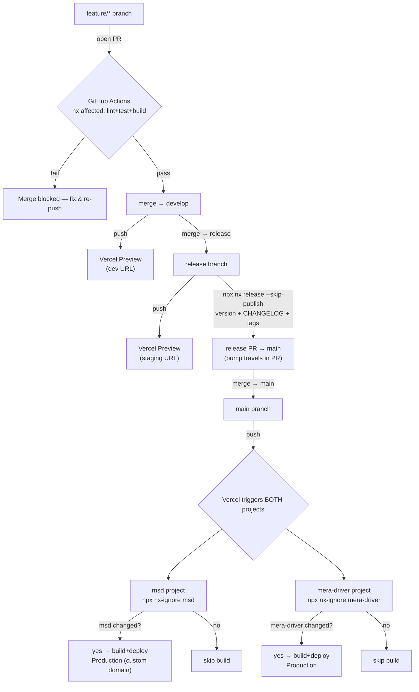

# Deployment

How the two frontends ship to Vercel, how each branch maps to an environment,
and how versioning works. This is the **source of truth**; `README.md`,
`CLAUDE.md`, `PLANNING.md`, and `TASK.md` link here rather than repeat it.

> Scope: the two **frontends** (`apps/msd`, `apps/mera-driver`) deploy to Vercel
> as **two independent Vercel projects**. The two Express APIs (`apps/msd-api`,
> `apps/mera-driver-api`) are long-running servers and host **off Vercel** — see
> [APIs](#apis-off-vercel) at the bottom.

## Branch flow

```
feature/*  ──PR──▶  develop  ──PR──▶  release  ──PR──▶  main
```

- **`feature/*`** — one branch per unit of work. Opening a PR runs the CI gate.
- **`develop`** — integration branch. Push → Vercel preview ("dev") URL.
- **`release`** — release candidate. Push → Vercel preview ("staging") URL; QA
  and stakeholders validate here. Version stamping happens on this branch.
- **`main`** — production. Merge → Vercel deploys to the production domain.

## Developer workflow (branch from develop, back-merge after release)

- **Always branch new work off `develop`** — never off `main`. `develop` is the
  daily source of truth; `main` is production-only and is not a base for feature
  work. Pattern: `git checkout develop && git pull && git checkout -b feature/<name>`.
- **Keep feature branches current** — merge or rebase the latest `develop` in
  regularly so they don't drift while in progress.
- **After every `release → main`, back-merge into `develop`.** The `nx release`
  step commits real changes on `release`/`main` (version bump in each app's
  `package.json`, `CHANGELOG.md`) that `develop` doesn't have. Skipping this makes
  `develop` fall behind production and causes conflicts / wrong versions at the
  next release. The sync:
  ```bash
  git checkout develop
  git pull                        # get develop up to date first
  git pull origin main --no-edit  # merge main (the release bump + changelogs) in
  git push                        # share it with the team
  ```
  (`--no-edit` accepts the default merge-commit message instead of opening an
  editor.) After this, `develop` = everything in production + in-flight work, and
  the team branches fresh features off it.
- **Tags are global refs.** `msd@x.y.z` / `mera-driver@x.y.z` are pushed once with
  `git push --follow-tags` and are visible from every branch — there is no
  per-branch tag sync.

## Flowchart



## How each Vercel project knows whether to deploy

`main` never routes "which project deploys." There are **two independent Vercel
projects**, both watching the same repo. Each runs `npx nx-ignore <app>` as its
**Ignored Build Step**. `nx-ignore` compares the Nx project graph of the current
commit against the last successful deploy and exits `0` (skip) when that app and
its dependencies weren't touched:

- Commit touches only `apps/msd` → **only msd** builds and deploys.
- Commit touches `packages/shared-ui` (a dependency of both) → **both** build.

No manual step, no dispatcher — each project self-selects on every push, at every
stage (`develop`/`release`/`main`).

## Branch → environment mapping

Set **one** thing per project: *Production Branch = `main`*. Vercel's Git
integration does the rest.

| Git branch | Vercel deploy | URL |
|------------|---------------|-----|
| `main` | Production | the bought custom domain (attached to Production) |
| `release` | Preview | Vercel auto URL — used as "staging" |
| `develop` | Preview | Vercel auto URL — used as "dev" |
| `feature/*`, PRs | Preview | ephemeral Vercel URL |

**Domains:** attach the bought domain to `main` (Production) on each project;
`release`/`develop` ride Vercel's auto preview URLs (no DNS work). A pretty
`staging.<domain>` subdomain is deferred — it's free on a domain you own (add the
subdomain in Vercel + one CNAME at the registrar, assign it to `release`) — do it
only when someone asks.

## Per-project Vercel config

Build config is committed as `apps/<app>/vercel.json` (config-as-code). Each
Vercel project uses **Root Directory = the app folder** and "Include files
outside the Root Directory in the Build Step" (on by default), so `cd ../..`
reaches the Nx workspace root.

`apps/msd/vercel.json` (React + Vite):
```json
{
  "buildCommand": "cd ../.. && npx nx build msd",
  "installCommand": "cd ../.. && npm ci",
  "outputDirectory": "../../dist/apps/msd",
  "ignoreCommand": "cd ../.. && npx nx-ignore msd",
  "framework": null,
  "rewrites": [{ "source": "/(.*)", "destination": "/index.html" }]
}
```

`apps/mera-driver/vercel.json` (Angular — note the `/browser` subfolder that
`@angular/build:application` emits):
```json
{
  "outputDirectory": "../../dist/apps/mera-driver/browser",
  "buildCommand": "cd ../.. && npx nx build mera-driver",
  "ignoreCommand": "cd ../.. && npx nx-ignore mera-driver"
}
```

The `rewrites` catch-all is the SPA fallback so client-side deep links resolve
(Vercel only applies a rewrite when no static asset matches, so JS/CSS still
serve directly). `framework: null` stops Vercel's preset from second-guessing the
Nx output path.

**Dashboard settings per project (once):**
- Root Directory: `apps/msd` / `apps/mera-driver` (enable "Include files outside
  root directory").
- Production Branch: `main`.
- Leave Build/Install/Output/Ignored-Build-Step blank — `vercel.json` wins.

> First-deploy check: validate the `../../` relative paths on the first **preview**
> deploy before trusting Production. If Vercel rejects the out-of-root
> `outputDirectory`, fall back to Root Directory = repo root + build settings in
> the dashboard + a single root `vercel.json` holding only the (identical) SPA
> rewrite.

## API base URLs

- **msd (Vite):** reads `import.meta.env.VITE_API_URL` at build. Set `VITE_API_URL`
  (+ the other `VITE_*` from `apps/msd/.env.example`) in the Vercel project's env
  vars; Vite bakes the right value at build. Scope a var to Production vs Preview
  when previews should hit a different API.
- **mera-driver (Angular):** the API base is compile-time via `fileReplacements`
  (`environment.ts` → `environment.prod.ts`). A Vercel env var won't reach it.
  First pass: point `apps/mera-driver/src/environments/environment.prod.ts` at the
  real production API origin. Only when staging/dev need a *different* API do you
  add `environment.staging.ts`/`environment.development.ts` + matching Nx build
  configurations and switch the preview build to `--configuration=staging`.

No secrets in `environment.*.ts` — public API base URL only.

### Environment variables — where each one lives

| Variable | Local (`.env.local`) | GitHub Actions | Vercel | Notes |
|----------|:--------------------:|:--------------:|:------:|-------|
| `VITE_API_URL` (msd) | ✅ dev value | ❌ | ✅ msd project (scope Prod vs Preview) | baked into the client bundle at build |
| `VITE_GOOGLE_MAPS_API_KEY` (msd) | ✅ | ❌ | ✅ msd project | **public** — restrict by HTTP referrer in Google Cloud Console |
| mera-driver API URL | ❌ (in `environment.ts`) | ❌ | ❌ (in `environment.prod.ts`) | compile-time; only needs Vercel vars if staging/dev split off |
| API secrets (`DATABASE_URL`, JWT, OAuth, OTP mailer) | API's own `.env.local` | ❌ | ❌ | live on the **API host** (Railway/Fly), never Vercel/GitHub |

- **Local:** only `apps/msd` needs a `.env.local` (copy `apps/msd/.env.example`).
  mera-driver reads committed `environment.*.ts`, no local env file.
- **GitHub Actions:** none required — CI runs `nx affected -t lint test build`,
  which compiles fine with `VITE_*` unset (only relevant at deploy, not in CI).
  Add a secret only if you later adopt Nx Cloud (`NX_CLOUD_ACCESS_TOKEN`).
- **Vercel:** set the `VITE_*` vars on the **msd** project only. `VITE_*` values
  ship to the browser — never store a real secret in one.

## Versioning (`nx release`)

Apps aren't published to a registry, so `nx release` is purely for traceability:
it stamps a per-app version, writes a `CHANGELOG.md`, and creates a git tag. Config
lives in `nx.json` (`release`: independent projects, `conventionalCommits`).

**Run it on the `release` branch, before the `release → main` PR** — not on
`main`. A bump commit on `main` would itself re-trigger Vercel; on `release` the
bump + changelog travel inside the PR and a human sees the version before ship.

```bash
# after develop → release is validated on the staging URL:
git checkout release && git pull
npx nx release --skip-publish      # bumps only changed apps, writes CHANGELOGs, tags
git push --follow-tags
# then open the release → main PR (bump + changelog travel with it)
```

`conventionalCommits` reads commit messages, so only the app(s) that actually
changed get bumped — producing tags like `msd@1.3.0`, `mera-driver@1.1.0`.

*Automated alternative (deferred):* a `.github/workflows/release.yml` on push to
`main` running `npx nx release --yes` — but that needs `[skip ci]` / ignore rules
so Vercel doesn't double-deploy off the bot's bump commit. Add it only when the
manual command becomes a chore.

## CI gate

`.github/workflows/ci.yml` runs on PRs into `develop`/`release`/`main`:
`npx nx affected -t lint test build` (base/head derived by `nrwl/nx-set-shas`).
Add it as a **required status check** in branch protection so it blocks merges.
Vercel still owns the actual deploy — CI only proves the affected graph is green.

## APIs (off Vercel)

`msd-api` and `mera-driver-api` are long-running Express servers (Swagger `/docs`
is just a route on each), so they belong on a **process host** — Railway or Fly.io
(workspace stack default), not Vercel. When wired:

- One service per API (independent, like the frontends). Build `npx nx build <api>`,
  start the emitted `main.js`.
- Secrets (`DATABASE_URL`, JWT, Google OAuth, OTP mailer) as host env vars, never in
  source. Run `prisma migrate deploy` + `prisma generate` on deploy.
- Point each frontend's API base URL (above) at that API's origin; docs at
  `<api-origin>/docs`.

No API host is provisioned yet — this section is the target for when the backends
are ready.
