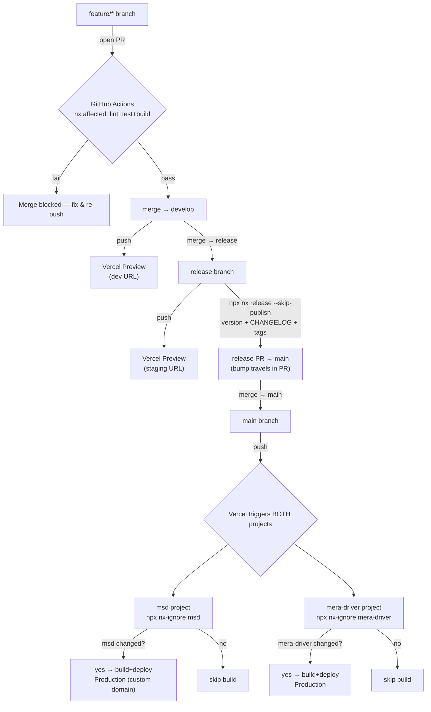

# Deployment

How the two frontends ship to Vercel, how each branch maps to an environment,
and how versioning works. This is the **source of truth**; `README.md`,
`CLAUDE.md`, `PLANNING.md`, and `TASK.md` link here rather than repeat it.

> Scope: the two **frontends** (`apps/msd`, `apps/mera-driver`) deploy to Vercel
> as **two independent Vercel projects**. The two Express APIs (`apps/msd-api`,
> `apps/mera-driver-api`) are long-running servers and host **off Vercel** — see
> [APIs](#apis-off-vercel) at the bottom.

## Branch flow

```
feature/*  ──PR──▶  develop  ──PR──▶  release  ──PR──▶  main
```

- **`feature/*`** — one branch per unit of work. Opening a PR runs the CI gate.
- **`develop`** — integration branch. Push → Vercel preview ("dev") URL.
- **`release`** — release candidate. Push → Vercel preview ("staging") URL; QA
  and stakeholders validate here. Version stamping happens on this branch.
- **`main`** — production. Merge → Vercel deploys to the production domain.

## Developer workflow (branch from develop, back-merge after release)

- **Always branch new work off `develop`** — never off `main`. `develop` is the
  daily source of truth; `main` is production-only and is not a base for feature
  work. Pattern: `git checkout develop && git pull && git checkout -b feature/<name>`.
- **Keep feature branches current** — merge or rebase the latest `develop` in
  regularly so they don't drift while in progress.
- **After every `release → main`, back-merge into `develop`.** The `nx release`
  step commits real changes on `release`/`main` (version bump in each app's
  `package.json`, `CHANGELOG.md`) that `develop` doesn't have. Skipping this makes
  `develop` fall behind production and causes conflicts / wrong versions at the
  next release. The sync:
  ```bash
  git checkout develop
  git pull                        # get develop up to date first
  git pull origin main --no-edit  # merge main (the release bump + changelogs) in
  git push                        # share it with the team
  ```
  (`--no-edit` accepts the default merge-commit message instead of opening an
  editor.) After this, `develop` = everything in production + in-flight work, and
  the team branches fresh features off it.
- **Tags are global refs.** `msd@x.y.z` / `mera-driver@x.y.z` are pushed once with
  `git push --follow-tags` and are visible from every branch — there is no
  per-branch tag sync.

## Flowchart



## How each Vercel project knows whether to deploy

`main` never routes "which project deploys." There are **two independent Vercel
projects**, both watching the same repo. Each runs `npx nx-ignore <app>` as its
**Ignored Build Step**. `nx-ignore` compares the Nx project graph of the current
commit against the last successful deploy and exits `0` (skip) when that app and
its dependencies weren't touched:

- Commit touches only `apps/msd` → **only msd** builds and deploys.
- Commit touches `packages/shared-ui` (a dependency of both) → **both** build.

No manual step, no dispatcher — each project self-selects on every push, at every
stage (`develop`/`release`/`main`).

## Branch → environment mapping

Set **one** thing per project: *Production Branch = `main`*. Vercel's Git
integration does the rest.

| Git branch | Vercel deploy | URL |
|------------|---------------|-----|
| `main` | Production | the bought custom domain (attached to Production) |
| `release` | Preview | Vercel auto URL — used as "staging" |
| `develop` | Preview | Vercel auto URL — used as "dev" |
| `feature/*`, PRs | Preview | ephemeral Vercel URL |

**Domains:** attach the bought domain to `main` (Production) on each project;
`release`/`develop` ride Vercel's auto preview URLs (no DNS work). A pretty
`staging.<domain>` subdomain is deferred — it's free on a domain you own (add the
subdomain in Vercel + one CNAME at the registrar, assign it to `release`) — do it
only when someone asks.

## Per-project Vercel config

Build config is committed as `apps/<app>/vercel.json` (config-as-code). Each
Vercel project uses **Root Directory = the app folder** and "Include files
outside the Root Directory in the Build Step" (on by default), so `cd ../..`
reaches the Nx workspace root.

`apps/msd/vercel.json` (React + Vite):
```json
{
  "buildCommand": "cd ../.. && npx nx build msd",
  "installCommand": "cd ../.. && npm ci",
  "outputDirectory": "../../dist/apps/msd",
  "ignoreCommand": "cd ../.. && npx nx-ignore msd",
  "framework": null,
  "rewrites": [{ "source": "/(.*)", "destination": "/index.html" }]
}
```

`apps/mera-driver/vercel.json` (Angular — note the `/browser` subfolder that
`@angular/build:application` emits):
```json
{
  "outputDirectory": "../../dist/apps/mera-driver/browser",
  "buildCommand": "cd ../.. && npx nx build mera-driver",
  "ignoreCommand": "cd ../.. && npx nx-ignore mera-driver"
}
```

The `rewrites` catch-all is the SPA fallback so client-side deep links resolve
(Vercel only applies a rewrite when no static asset matches, so JS/CSS still
serve directly). `framework: null` stops Vercel's preset from second-guessing the
Nx output path.

**Dashboard settings per project (once):**
- Root Directory: `apps/msd` / `apps/mera-driver` (enable "Include files outside
  root directory").
- Production Branch: `main`.
- Leave Build/Install/Output/Ignored-Build-Step blank — `vercel.json` wins.

> First-deploy check: validate the `../../` relative paths on the first **preview**
> deploy before trusting Production. If Vercel rejects the out-of-root
> `outputDirectory`, fall back to Root Directory = repo root + build settings in
> the dashboard + a single root `vercel.json` holding only the (identical) SPA
> rewrite.

## API base URLs

- **msd (Vite):** reads `import.meta.env.VITE_API_URL` at build. Set `VITE_API_URL`
  (+ the other `VITE_*` from `apps/msd/.env.example`) in the Vercel project's env
  vars; Vite bakes the right value at build. Scope a var to Production vs Preview
  when previews should hit a different API.
- **mera-driver (Angular):** the API base is compile-time via `fileReplacements`
  (`environment.ts` → `environment.prod.ts`). A Vercel env var won't reach it.
  First pass: point `apps/mera-driver/src/environments/environment.prod.ts` at the
  real production API origin. Only when staging/dev need a *different* API do you
  add `environment.staging.ts`/`environment.development.ts` + matching Nx build
  configurations and switch the preview build to `--configuration=staging`.

No secrets in `environment.*.ts` — public API base URL only.

### Environment variables — where each one lives

| Variable | Local (`.env.local`) | GitHub Actions | Vercel | Notes |
|----------|:--------------------:|:--------------:|:------:|-------|
| `VITE_API_URL` (msd) | ✅ dev value | ❌ | ✅ msd project (scope Prod vs Preview) | baked into the client bundle at build |
| `VITE_GOOGLE_MAPS_API_KEY` (msd) | ✅ | ❌ | ✅ msd project | **public** — restrict by HTTP referrer in Google Cloud Console |
| mera-driver API URL | ❌ (in `environment.ts`) | ❌ | ❌ (in `environment.prod.ts`) | compile-time; only needs Vercel vars if staging/dev split off |
| API secrets (`DATABASE_URL`, JWT, OAuth, OTP mailer, R2 keys) | API's own `.env.local` | ❌ | ❌ | live on the **API host** (Railway), never Vercel/GitHub — see [Deploying msd-api](#deploying-msd-api-step-by-step) |

- **Local:** only `apps/msd` needs a `.env.local` (copy `apps/msd/.env.example`).
  mera-driver reads committed `environment.*.ts`, no local env file.
- **GitHub Actions:** none required — CI runs `nx affected -t lint test build`,
  which compiles fine with `VITE_*` unset (only relevant at deploy, not in CI).
  Add a secret only if you later adopt Nx Cloud (`NX_CLOUD_ACCESS_TOKEN`).
- **Vercel:** set the `VITE_*` vars on the **msd** project only. `VITE_*` values
  ship to the browser — never store a real secret in one.

## Versioning (`nx release`)

Apps aren't published to a registry, so `nx release` is purely for traceability:
it stamps a per-app version, writes a `CHANGELOG.md`, and creates a git tag. Config
lives in `nx.json` (`release`: independent projects, `conventionalCommits`).

**Run it on the `release` branch, before the `release → main` PR** — not on
`main`. A bump commit on `main` would itself re-trigger Vercel; on `release` the
bump + changelog travel inside the PR and a human sees the version before ship.

```bash
# after develop → release is validated on the staging URL:
git checkout release && git pull
npx nx release --skip-publish      # bumps only changed apps, writes CHANGELOGs, tags
git push --follow-tags
# then open the release → main PR (bump + changelog travel with it)
```

`conventionalCommits` reads commit messages, so only the app(s) that actually
changed get bumped — producing tags like `msd@1.3.0`, `mera-driver@1.1.0`.

*Automated alternative (deferred):* a `.github/workflows/release.yml` on push to
`main` running `npx nx release --yes` — but that needs `[skip ci]` / ignore rules
so Vercel doesn't double-deploy off the bot's bump commit. Add it only when the
manual command becomes a chore.

## CI gate

`.github/workflows/ci.yml` runs on PRs into `develop`/`release`/`main`:
`npx nx affected -t lint test build` (base/head derived by `nrwl/nx-set-shas`).
Add it as a **required status check** in branch protection so it blocks merges.
Vercel still owns the actual deploy — CI only proves the affected graph is green.

## APIs (off Vercel)

`msd-api` and `mera-driver-api` are long-running Express servers (Swagger `/docs`
is just a route on each), so they belong on a **process host**, not Vercel. We host
them on **Railway** (always-on Node process; runs the Express app as-is — no
serverless rewrite). Each API is its own Railway service, exactly like the two
frontends are two Vercel projects.

**Why not a second Vercel project for the API?** Vercel runs code as short-lived
serverless functions with an **ephemeral filesystem** (uploaded files vanish on
every redeploy), needs a *pooled* DB connection string, and breaks the in-memory
rate limiter / OTP / OAuth state across function instances. Railway has none of
those problems and matches this repo's design.

The three layers stay separate:

| Layer | What it holds | Where it lives |
|-------|---------------|----------------|
| **Compute** (the Express server) | your API code | **Railway** (one service per API) |
| **Database** (text/structured data) | users, roles, orders, deal text, image **URLs** | **Neon** Postgres (already attached to the msd Vercel project) |
| **File storage** (image **bytes**) | the actual `.jpg`/`.png`/video files | **Cloudflare R2** (10 GB free, no egress fees) |

> **mera-driver-api** follows the identical Railway + its own Neon DB + R2 bucket
> pattern when it's ready — repeat the steps below with `mera-driver-api` paths and
> its own database/bucket. Everything below is written for **msd-api**.

---

## Deploying msd-api (step by step)

First time doing Railway/Cloudflare? Follow these in order. Do **A → B** locally
first (proves the code + DB work before any cloud config), then **C → F**.

### A. Get your Neon database connection string

You already have a Neon database (attached to the msd project in Vercel). You do
**not** create a new one and you do **not** delete it — the API reuses the same DB.

1. Open the **Neon dashboard** (neon.tech) → your project → **Connection Details**
   (or in Vercel: msd project → **Storage** → your Neon store → **`.env.local`** tab).
2. Copy the connection string. It looks like:
   `postgresql://<user>:<password>@<host>.neon.tech/<db>?sslmode=require`
3. Neon shows two kinds of string — a **direct** one and a **pooled** one (host has
   `-pooler` in it). For Railway (an always-on server) use the **direct** string.
   Keep it secret; it is a password.

### B. Test the database locally first

This catches problems on your own machine, where they're easy to fix.

1. Create `apps/msd-api/.env.local` (copy from `apps/msd-api/.env.example`) and set
   `DATABASE_URL` to the Neon string from step A. Fill the other secrets too
   (`JWT_SECRET`, etc.). This file is git-ignored — never commit it.
2. Install deps and generate the Prisma client, then apply the schema and seed:
   ```bash
   npm ci                                 # installs the pinned prisma 6.19.3
   npm run msd-api:prisma:generate        # generates src/generated/prisma-client
   npm run msd-api:prisma:migrate         # or: prisma migrate deploy (applies schema to Neon)
   npm run msd-api:prisma:seed            # seeds the 6 default roles + permissions + SuperAdmin
   ```
   > **Do not run bare `npx prisma …`** — it pulls Prisma **7**, which errors on this
   > schema (`datasource property url is no longer supported`). Always use the
   > `npm run msd-api:prisma:*` scripts, which use the repo's pinned **6.19.3**.
3. Start the API and open the docs:
   ```bash
   npx nx serve msd-api                   # http://localhost:3333/api/v1
   ```
   Visit `http://localhost:3333/docs` (Swagger loads) and hit a public route. If this
   works against Neon, the cloud deploy is just moving the same env vars to Railway.

### C. Deploy msd-api to Railway

1. Go to **railway.app** → sign up with GitHub (no credit card needed for the trial
   credit).
2. **New Project → Deploy from GitHub repo** → pick this repo. Authorize Railway to
   read it if asked. Railway builds from the **repo root** (the Nx workspace) — leave
   the root directory as the repo root, do **not** set it to `apps/msd-api`.
3. Open the created **service → Settings** and set:
   - **Build Command:** `npm ci && npx nx build msd-api`
   - **Start Command:** `node dist/apps/msd-api/main.js`
   - **Pre-Deploy / Deploy Command** (runs each deploy, applies DB changes):
     `npm run msd-api:prisma:generate && node node_modules/prisma/build/index.js migrate deploy --schema=apps/msd-api/prisma/schema.prisma`

     (Simplest equivalent: a `railway.json` or a small `package.json` script that runs
     `prisma generate` then `prisma migrate deploy` for the msd-api schema. The key is
     both run on every deploy, using the pinned Prisma 6.19.3.)
   - **Port:** none to set — the app reads Railway's injected `PORT` automatically
     (`apps/msd-api/src/config/env.ts` → `optionalInt('PORT', 3333)`).
4. Open **service → Variables** and add the environment variables from
   `apps/msd-api/.env.example` as real values (see the table in [F](#f-environment-variables-on-railway)).
   At minimum: `DATABASE_URL` (Neon, step A), `NODE_ENV=production`, `JWT_SECRET`
   (a fresh strong value), the OAuth/OTP/SMTP/SMS/Razorpay keys, `CORS_ORIGIN`, and
   the R2 vars from step D.
5. Open **service → Settings → Networking → Generate Domain**. Railway gives you a
   public URL like `https://msd-api-production.up.railway.app`. Your API base is that
   URL **plus** `/api/v1`; docs are at `<url>/docs`.

### D. Set up Cloudflare R2 for image files

Railway's disk is wiped on every redeploy, so uploaded images must live outside it.
R2 is S3-compatible object storage with a free tier.

1. Go to **cloudflare.com** → sign up → dashboard → **R2** (left sidebar) → enable it
   (asks for a card for verification but the 10 GB tier is free; no egress fees).
2. **Create bucket** → name it `msd-media` → create.
3. **Make images publicly readable:** open the bucket → **Settings** → **Public
   access** → enable the **r2.dev** public URL (or connect a custom domain). Copy the
   public base URL, e.g. `https://pub-<hash>.r2.dev`.
4. **Create an API token:** R2 → **Manage R2 API Tokens** → **Create API Token** →
   permission **Object Read & Write** → create. Copy the **Access Key ID** and
   **Secret Access Key** (shown once).
5. Note your **Account ID** (R2 overview page). The S3 endpoint is
   `https://<ACCOUNT_ID>.r2.cloudflarestorage.com`.
6. These become the `R2_*` env vars on Railway (table in F) plus `VITE_MEDIA_BASE_URL`
   on Vercel (step E). The code that writes/reads media via R2 is **already in place**
   — see [Media storage: local disk → R2](#media-storage-local-disk--r2-already-done-in-code)
   below; you only configure the env vars.

### E. Point the msd frontend (Vercel) at the deployed API

1. In **Vercel → msd project → Settings → Environment Variables**, set two vars
   (Production scope; add Preview values too if previews should hit the same API/bucket):
   - `VITE_API_URL = https://<railway-domain>/api/v1`
   - `VITE_MEDIA_BASE_URL = https://pub-<hash>.r2.dev` (the R2 bucket public URL from
     step D — the frontend loads images directly from R2 with this).

   Vite bakes both at build, so **redeploy msd** afterward.
2. On **Railway**, set `CORS_ORIGIN` to your msd Vercel domain(s), comma-separated
   for prod + preview, e.g.
   `https://massagedeals.example,https://msd-git-develop-yourteam.vercel.app`.
   (`env.ts` splits `CORS_ORIGIN` on commas — multiple origins already work.)
3. **Google OAuth:** in Google Cloud Console → Credentials → your OAuth client, add
   the authorized redirect URI `https://<railway-domain>/api/v1/auth/google/callback`,
   and set the same value as `GOOGLE_CALLBACK_URL` on Railway.

### F. Environment variables on Railway

Set these on the msd-api Railway service (never in git). Values come from your Neon
DB, your providers, and Cloudflare R2:

| Variable | Value / source |
|----------|----------------|
| `DATABASE_URL` | Neon **direct** connection string (step A) |
| `NODE_ENV` | `production` |
| `JWT_SECRET` | a fresh strong random string (not the example one) |
| `JWT_ACCESS_TTL_MINUTES`, `JWT_REFRESH_TTL_DAYS` | as in `.env.example` |
| `OTP_*` | as in `.env.example` |
| `GOOGLE_CLIENT_ID`, `GOOGLE_CLIENT_SECRET` | your Google OAuth app |
| `GOOGLE_CALLBACK_URL` | `https://<railway-domain>/api/v1/auth/google/callback` |
| `CORS_ORIGIN` | msd Vercel domain(s), comma-separated |
| `SMTP_*`, `EMAIL_FROM` | your email provider (email OTP) |
| `SMS_API_URL`, `SMS_API_KEY`, `SMS_SENDER` | your SMS provider (phone OTP) |
| `RAZORPAY_*` | your Razorpay keys |
| `R2_ACCOUNT_ID` | Cloudflare account ID (step D) |
| `R2_ACCESS_KEY_ID`, `R2_SECRET_ACCESS_KEY` | R2 API token (step D) |
| `R2_BUCKET` | `msd-media` |

The R2 **public** URL is not a Railway var — it's a frontend var
(`VITE_MEDIA_BASE_URL` on the msd Vercel project, step E), because the browser loads
images from R2 directly. The API only needs the four upload credentials above.

> **Security — rotate these now:** `apps/msd-api/.env.example` previously held **real**
> secrets. The template is now blanked, but the old values were committed to git
> history, so rotate them at each provider (Gmail app password, ConnectExpress SMS
> key, Razorpay keys, and pick a fresh `JWT_SECRET`). Real values belong only in
> `.env.local` (local) and Railway (production) — never in a committed file.

### Media storage: local disk → R2 (already done in code)

msd-api previously wrote uploads to a local folder and served them at `/media/...`,
which doesn't survive Railway redeploys. The storage backend is now **Cloudflare
R2**, and the browser loads images **directly** from R2's public URL (no image
traffic through the API — better for Railway's free bandwidth). The DB is unchanged:
it still stores the relative `storageKey` (e.g. `deals/<id>/<uuid>.jpg`), which is
also the R2 object key, so the R2 public URL can change without a data migration.

What changed (for reference — no action needed, just configure the env vars):

- **`apps/msd-api/src/lib/media-storage.ts`** — `writeMediaFile`/`deleteMediaFile`
  now use `@aws-sdk/client-s3` (`PutObjectCommand`/`DeleteObjectCommand`) against the
  R2 endpoint (`https://<R2_ACCOUNT_ID>.r2.cloudflarestorage.com`, region `auto`). The
  S3 client is built lazily, so importing the module never requires R2 configured
  (tests mock it). Signatures are unchanged, so `services/media.service.ts` was untouched.
- **`apps/msd-api/src/app.ts`** — the `/media` static mount is removed.
- **`apps/msd-api/src/config/env.ts`** — reads `R2_ACCOUNT_ID`, `R2_ACCESS_KEY_ID`,
  `R2_SECRET_ACCESS_KEY`, `R2_BUCKET` (the four upload credentials).
- **`apps/msd/src/api/media.ts`** — `resolveMediaUrl()` now prefixes
  `VITE_MEDIA_BASE_URL` (the R2 public URL) onto a relative `storageKey`, instead of
  the API's old `/media` mount. Legacy absolute-URL rows still pass through unchanged.
- **`@aws-sdk/client-s3`** was added to dependencies.

So to go live you only need to: create the R2 bucket + token (step D), set the four
`R2_*` vars on Railway (step F), and set `VITE_MEDIA_BASE_URL` on the msd Vercel
project (step E). No further code work.

### G. Verify end-to-end (after deploy)

- `https://<railway-domain>/docs` loads (Swagger UI renders).
- A public route (e.g. catalog) returns real data from Neon.
- Upload a deal/product image in the admin console → the object appears in the R2
  bucket, the response returns an `R2_PUBLIC_BASE_URL` link, the image loads in the
  browser, and **still loads after you redeploy the Railway service** (proves it's
  not on the ephemeral disk).
- On the live msd Vercel site: sign in (OTP/Google), open `/account`, confirm data
  loads and there are **no CORS errors** in the browser console.
