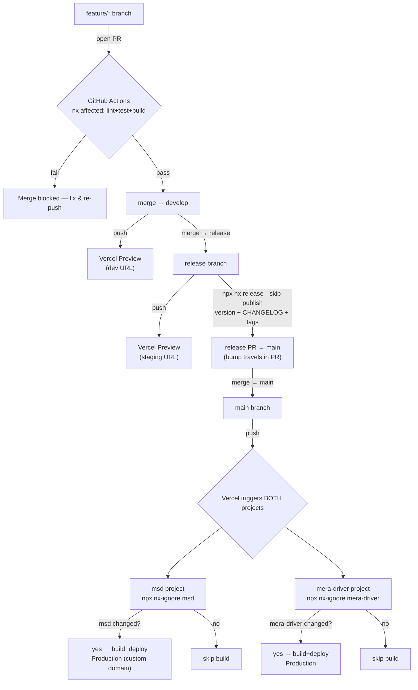

# skylabs-monorepo

Nx 22 monorepo running **two separate products** from one codebase, sharing a
single Material 3 design system.

| App | Tech | Port | Business | Theme |
| --- | --- | --- | --- | --- |
| `apps/msd` | React 19 + Vite | 4200 | Massage deals | Green `#007C2B` |
| `apps/mera-driver` | Angular 21 + Tailwind | 4400 | Driver booking | Blue `#1175BC` |
| `apps/msd-api` | Express + Prisma + PostgreSQL | 3333 | msd backend (RBAC) | — |
| `apps/mera-driver-api` | Express + Prisma + PostgreSQL | 3334 | mera-driver backend (RBAC) | — |

Shared code lives in `packages/` (`shared-ui` design system + `shared-*` RBAC
libraries). The two apps are different businesses with fully independent backends
and databases — see [`ARCHITECTURE.md`](ARCHITECTURE.md).

## Quick start

```bash
npm ci

# Serve (dev)
npx nx serve msd                # http://localhost:4200
npx nx run mera-driver:serve    # http://localhost:4400
npx nx serve msd-api            # http://localhost:3333/api/v1  (docs at /docs)
npx nx serve mera-driver-api    # http://localhost:3334         (docs at /docs)

# Build
npx nx build msd
npx nx build mera-driver

# Lint / test / build the whole graph
npx nx run-many -t lint test build
npx nx affected -t build --base=main
```

## Docs

- [`PLANNING.md`](PLANNING.md) — scope, stack, roadmap
- [`ARCHITECTURE.md`](ARCHITECTURE.md) — layout, what goes where
- [`TASK.md`](TASK.md) — what's done / in progress / backlog
- [`CLAUDE.md`](CLAUDE.md) — guidance for Claude Code + AI dev team
- [`DEPLOYMENT.md`](DEPLOYMENT.md) — how the apps ship (below)

## Deployment

Branch flow `feature/* → develop → release → main`. The two frontends deploy to
**two independent Vercel projects**; each self-selects on every push via
`nx-ignore`, so a commit only rebuilds the app(s) it actually affects. `main` is
Production (custom domain); `release`/`develop` use Vercel preview URLs.
Versioning is `npx nx release --skip-publish` run on the `release` branch. The two
Express APIs host **off Vercel on Railway** (always-on Node servers), reusing the
Neon Postgres database, with image files on Cloudflare R2. Step-by-step deploy guide
for msd-api (Railway + Neon + R2 + wiring the Vercel frontend): [`DEPLOYMENT.md`](DEPLOYMENT.md#deploying-msd-api-step-by-step).



Full detail — Vercel project settings, domains, env vars, `nx release` workflow —
in [`DEPLOYMENT.md`](DEPLOYMENT.md).
